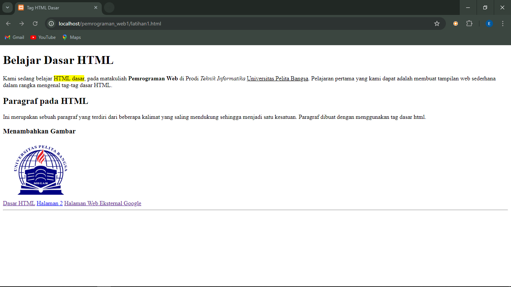

# Authors
Dzikry Eza Yusuf  
Teknik Informatika 23.A2  
Universitas Pelita Bangsa 

# Tugas HTML dasar
Tugas Pemrograman Web 1  
Pertemuan 2 Semester 3

# 1. Membuat Paragraf

# 2. Menambahkan Judul

# 3. Memformat Teks

# 4. Menyisipkan Gambar

# 5 Menambahkan HyperLink

